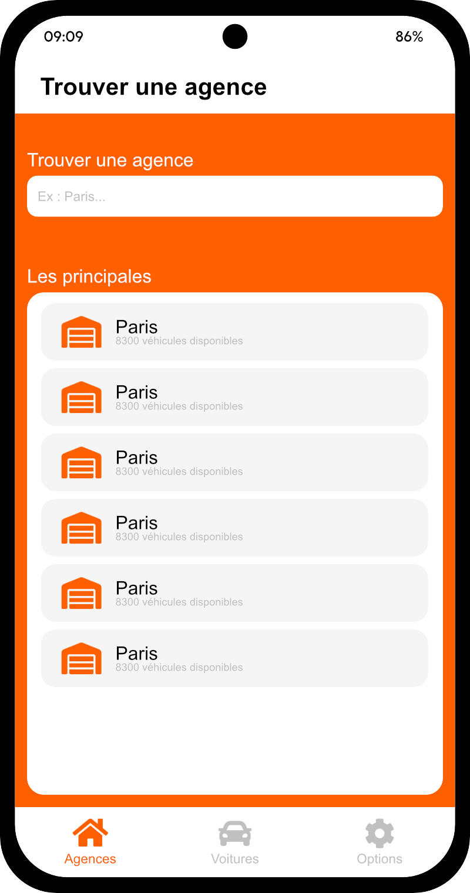
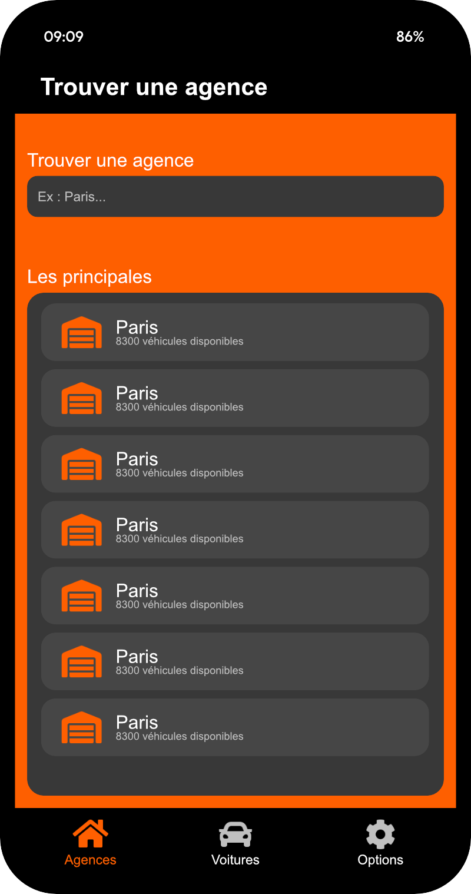
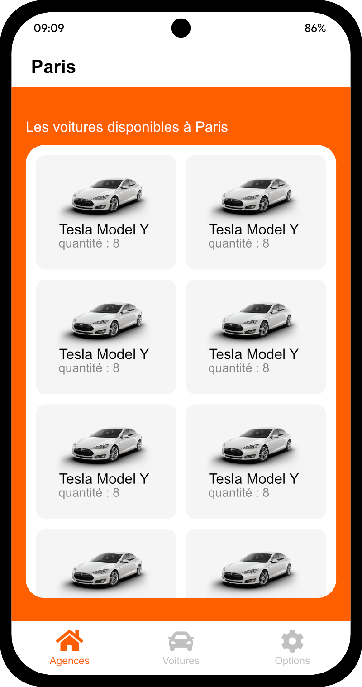
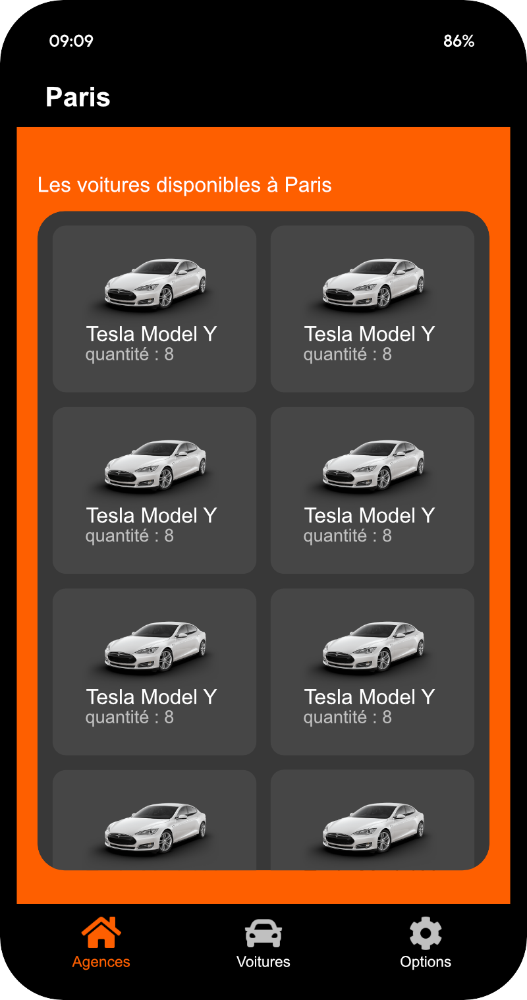
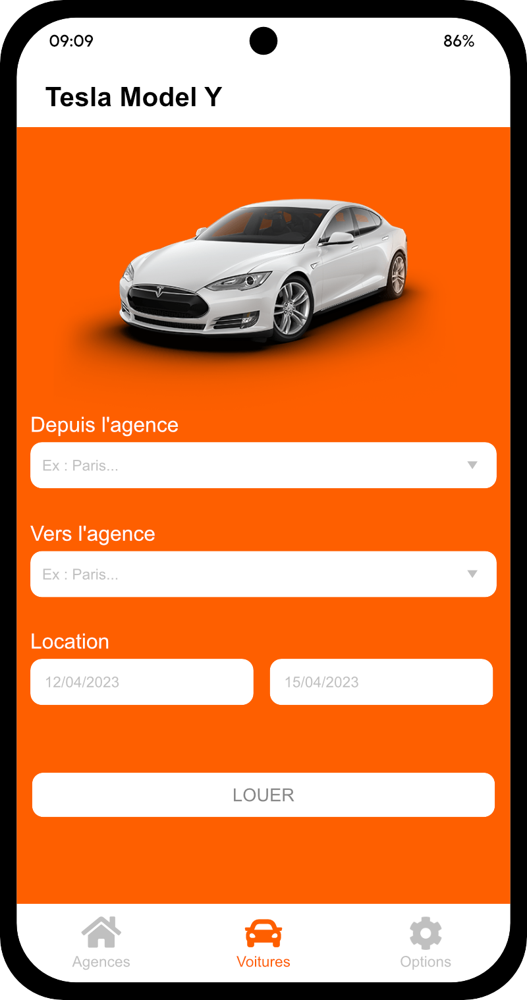
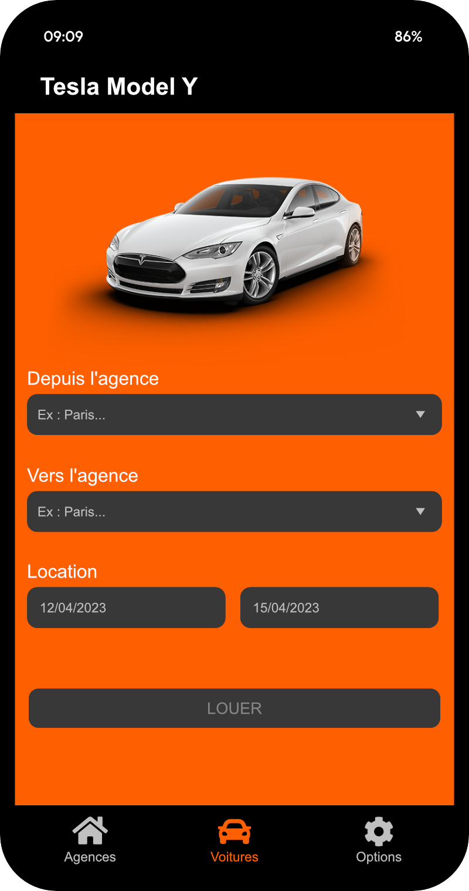
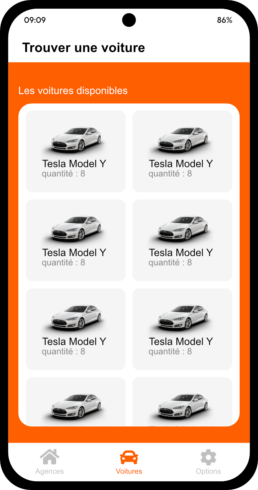
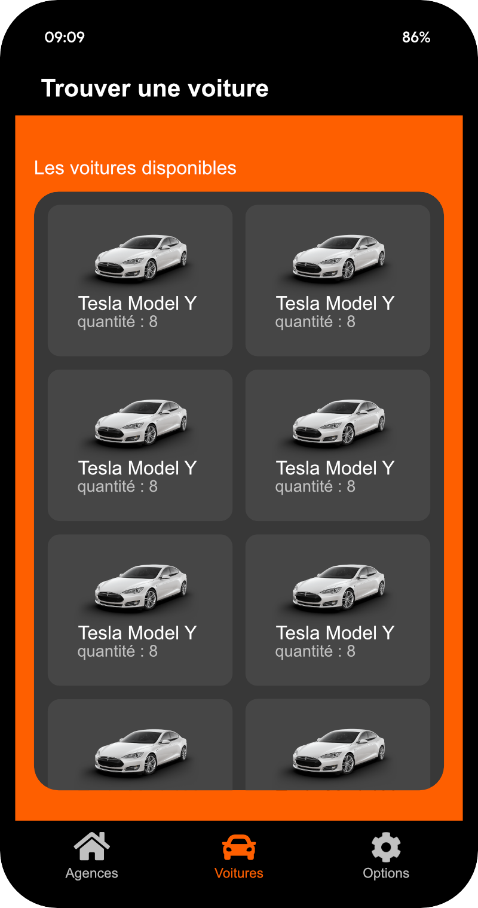

# React Native VroumExpress App

## Prerequisites

- [NodeJs > 12 (LTS 18 recommended)](https://nodejs.org) 
- npm (or yarn)
- [expo-cli installed globally](https://docs.expo.dev/more/expo-cli/)

## Base dependencies

- [react-navigation](https://reactnavigation.org/) navigation library.
- [redux](https://redux.js.org/) for state management.
- [redux-thunk](https://github.com/gaearon/redux-thunk) to dispatch asynchronous actions.

## Usage

To install all dependencies, use `npm install` (or `yarn install` if you are using yarn)  
To start the project, use `npx wexpo start`

## Folder structure

This template follows a very simple project structure:

- `sources`:
  - `assets`: Asset folder to store all images, vectors, etc.
  - `components`: Folder to store any common component that you use through your app (such as a generic button)
  - `navigation`: Folder to store the navigators.
  - `screens`: Folder that contains all screens/features.
  - `redux`:
    - `actions`: This folder contains all actions that can be dispatched to redux.
    - `reducers`: This folder should have all your reducers, and expose the combined result using its `index.js`
  - `styles`: Folder to store all the styling concerns related to the application theme.
  - `App.js`: Main component that starts the app.

## Sketches

Explaination|Light Theme|Dark Theme|
|:---------:|:---------:|:--------:|
Screen where you can find an agency by name|||
Screen where you can see all cars aviable in the selected agency|||
Screen to see the car and rent it|||
Screen to see all aviable cars|||